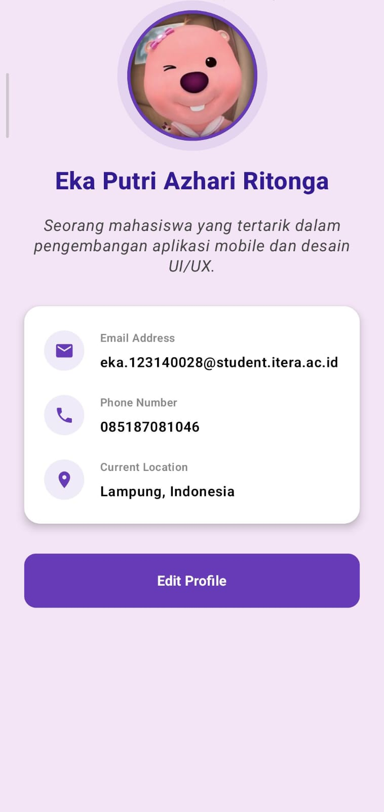

# My Profile App

Sebuah aplikasi Android modern berbasis **Jetpack Compose** yang dirancang untuk menampilkan profil pribadi dengan estetika visual yang elegan dan interaktif.

## Fitur Utama
- **Entrance Animation**: Menggunakan `AnimatedVisibility` dengan kombinasi `fadeIn` dan `slideInVertically` untuk memberikan efek kemunculan elemen yang halus dan profesional saat aplikasi dijalankan.
- **Desain Visual Elegan**: Mengusung tema warna **Deep Purple** yang konsisten, memberikan kesan modern dan premium.
- **Header Profil Interaktif**: Foto profil berbentuk lingkaran dengan *border* kustom dan latar belakang aksen yang mempertegas elemen utama.
- **Kartu Informasi (Profile Card)**: Menggunakan `Material3 Card` dengan *elevation* dan *rounded corners* untuk menyajikan detail kontak (Email, WhatsApp, Lokasi) secara rapi dan mudah dibaca.
- **UI/UX Responsif**: Tata letak yang bersih dengan tipografi yang dioptimalkan menggunakan font weight yang bervariasi untuk hierarki informasi yang jelas.

## Teknologi yang Digunakan
- **Language**: [Kotlin](https://kotlinlang.org/)
- **UI Toolkit**: [Jetpack Compose](https://developer.android.com/jetpack/compose)
- **Design System**: Material Design 3 (M3).
- **Icons**: Material Icons (Default).
- **Animation**: Compose Animation Framework.

## Tampilan Aplikasi

**Informasi Profil:**
- **Nama**: Eka Putri Azhari Ritonga
- **Deskripsi**: Mahasiswa yang berfokus pada pengembangan aplikasi mobile dan desain UI/UX.
- **Lokasi**: Lampung, Indonesia.

## Cara Instalasi & Menjalankan
1. **Clone** repositori ini.
2. Buka proyek di **Android Studio (Ladybug atau versi terbaru)**.
3. Sinkronisasikan proyek dengan **Gradle Files**.
4. Jalankan aplikasi pada **Emulator** atau **Smartphone Android** Anda.
