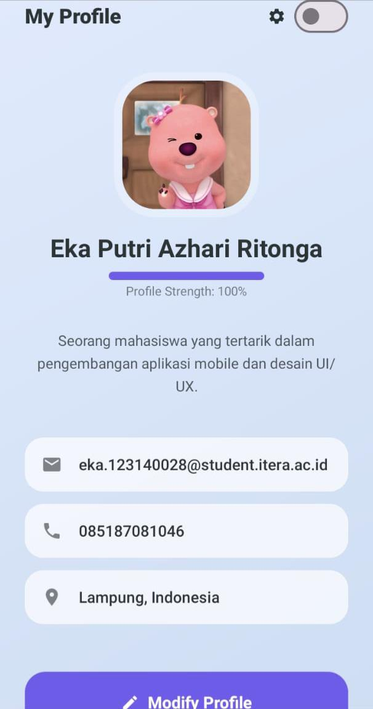
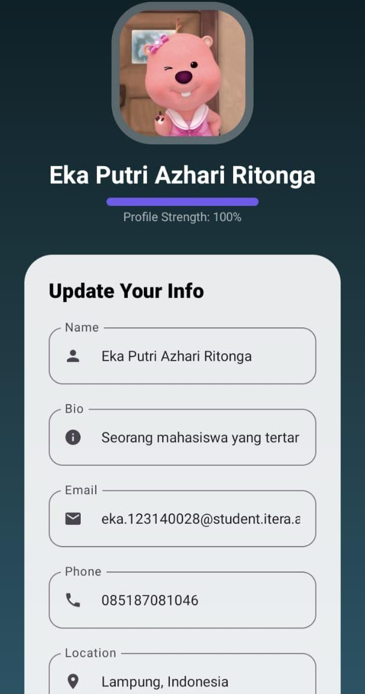
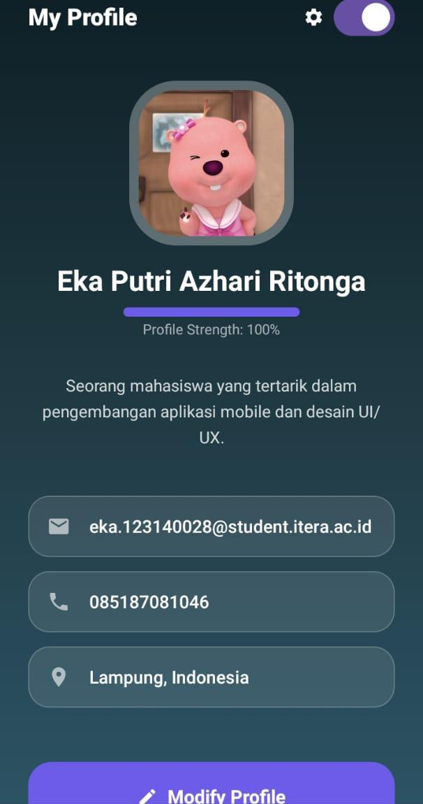

# My Profile App V2 📱

Proyek ini adalah aplikasi profil personal yang saya bangun menggunakan **Jetpack Compose**. Fokus utamanya adalah menciptakan antarmuka yang modern dengan arsitektur **MVVM** agar kode lebih rapi dan mudah dikelola.

---

## 🔥 Apa yang Spesial dari Aplikasi Ini?

### 💎 Desain Aurora Glassmorphism
Saya tidak ingin membuat aplikasi yang tampilannya membosankan. Aplikasi ini menggunakan gaya **Glassmorphism**, di mana setiap kartu informasi terlihat transparan seperti kaca melayang di atas latar belakang gradasi **Aurora** yang halus.

### 🌑 Dark Mode & Tema Dinamis
Sudah mendukung fitur Dark Mode manual. Saat switch dinyalakan, seluruh warna aplikasi—termasuk gradasi latar belakangnya—akan berubah secara otomatis menyesuaikan suasana gelap yang nyaman di mata.

### 📊 Indikator Kelengkapan Profil
Di bawah nama, saya menambahkan **Linear Progress Bar**. Garis ini akan bertambah secara otomatis sesuai dengan seberapa lengkap data yang sudah diisi (Nama, Bio, Email, No HP, dan Lokasi).

---

## 🛠️ Detail Teknis

- **Bahasa**: Kotlin 100%
- **Arsitektur**: MVVM (Model-View-ViewModel)
- **UI Framework**: Jetpack Compose (Material Design 3)
- **State Management**: StateFlow untuk pembaruan data secara real-time
- **Layout**: Squircle Avatar (kotak membulat ala iOS) dan Frosted Glass Cards

---

## 📂 Struktur Project

- **`MainActivity.kt`**: Berisi seluruh komponen visual dan layout aplikasi.
- **`ProfileViewModel.kt`**: Mengatur logika bisnis, seperti menyimpan data dan perpindahan mode edit.
- **`ProfileUiState.kt`**: Tempat penyimpanan data profil dan variabel penampung sementara.

---

## 📸 Dokumentasi Tampilan

Berikut adalah penampakan aplikasi saat dijalankan:

---

## 🚀 Cara Menjalankan
1. Buka proyek ini di **Android Studio** (Disarankan versi Ladybug ke atas).
2. Hubungkan HP Android atau nyalakan Emulator.
3. Tunggu proses **Gradle Sync** sampai selesai.
4. Klik tombol **Run 'app'**.

---

**Dikerjakan oleh:**  
**Eka Putri Azhari Ritonga**  
**NIM: 123140028**
