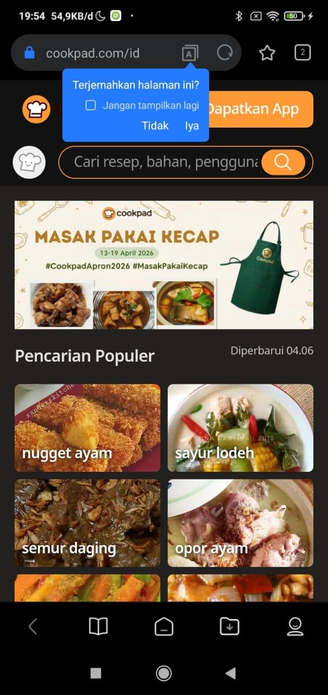

# 📰 NewsReaderApp - Aplikasi Berita Indonesia

NewsReaderApp adalah aplikasi pembaca berita berbasis Android yang dikembangkan menggunakan Jetpack Compose. Aplikasi ini menawarkan tampilan yang sederhana dan modern, mendukung dark mode, serta menyediakan fitur penyimpanan offline agar tetap dapat digunakan tanpa koneksi internet.

## 🚀 Fitur Utama
- UI modern dengan dukungan dark mode menggunakan kombinasi warna Navy dan Charcoal yang nyaman di mata.
- Fitur offline caching menggunakan Room Database sehingga berita tetap bisa diakses tanpa internet.
- Efek loading menggunakan shimmer (skeleton screen) untuk pengalaman pengguna yang lebih halus.
- Integrasi Chrome Custom Tabs untuk membuka artikel langsung di dalam aplikasi.
- Pembaruan berita secara acak setiap kali pengguna melakukan refresh.

## 🛠️ Tech Stack
- Jetpack Compose (Material 3) untuk membangun antarmuka pengguna.
- Ktor Client untuk kebutuhan networking.
- Room Database sebagai penyimpanan lokal.
- Coil untuk memuat gambar dengan cepat dan efisien.
- Navigation Compose untuk navigasi antar halaman.
- Arsitektur MVVM untuk menjaga struktur kode tetap rapi dan terorganisir.

## 🎥 Video Demonstrasi
https://github.com/user-attachments/assets/9a7c574f-0376-4808-a384-4468cd494378

## 📸 Screenshots

| Home | Detail | Browser |
|------|--------|---------|
|  |  |  |

## 🔌 API & Data
Aplikasi ini menerapkan Repository Pattern dengan pendekatan Local-First:
1. Data diambil terlebih dahulu dari Room Database.
2. Data remote disimulasikan melalui NewsRepositoryImpl dengan konten dinamis.
3. Data terbaru akan disimpan kembali ke database lokal untuk kebutuhan offline.

---

## 👤 Identitas pengembang
Nama: Eka Putri Azhari Ritonga  
NIM: 123140028
