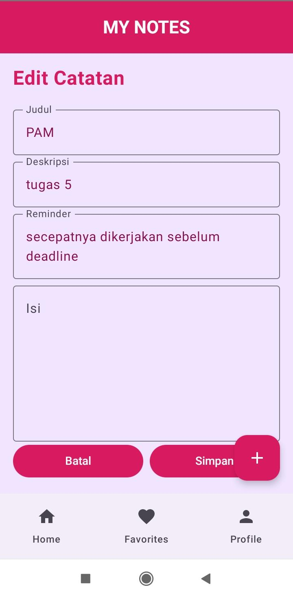
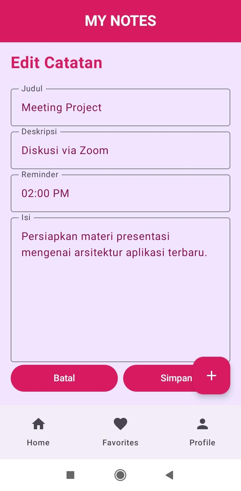
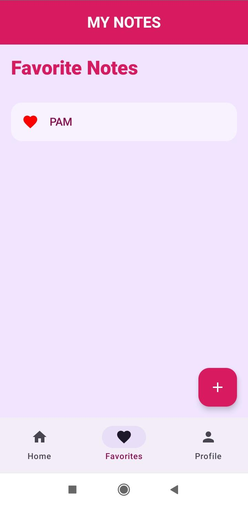

# 📝 Notes App Navigation

Aplikasi catatan modern berbasis **Jetpack Compose** yang menampilkan sistem navigasi, UI estetik, serta pengelolaan data dinamis menggunakan State di Android.

---

## 🚀 Fitur Utama

### 🔹 Navigasi & Arsitektur
- Menggunakan `Sealed Class` (`Screen`, `BottomNavItem`) untuk navigasi yang terpusat dan *type-safe*
- Bottom Navigation (Home, Favorites, Profile) dengan pengelolaan *backstack* (`saveState`, `restoreState`)
- Navigasi dinamis dengan pengiriman data (`noteId`) melalui `navArgument`

### 🔹 State Management (CRUD)
- **Create** → Menambah catatan melalui `AddNoteScreen`
- **Read** → Menampilkan catatan di Home, Favorites, dan `NoteDetailScreen`
- **Update** → Mengedit catatan melalui `EditNoteScreen`
- Sinkronisasi data secara real-time dengan `mutableStateListOf`

### 🔹 UI & Design (Material 3)
- Komponen kustom `NoteItem` dengan desain kartu modern
- Tampilan visual menggunakan Gradient, Tonal Elevation, dan Custom Shapes
- Halaman Profile dengan foto, tombol edit, dan informasi NIM

---

## 🎥 Demo
https://github.com/user-attachments/assets/bcd28b21-7f17-48f0-a328-514772f807e5

---

## 📸 Screenshot

### Home & Detail
| Home | Detail |
|------|--------|
|  |  |

### Favorites & Profile
| Favorites | Profile |
|----------|---------|
|  |  |

---

## 🧩 Struktur Layar
- **Home (My Daily Notes)** → Daftar catatan interaktif + status favorit  
- **Note Detail** → Detail catatan + informasi reminder  
- **Favorites** → Daftar catatan yang disukai  
- **Profile** → Informasi pengguna  

---

## 🛠️ Teknologi yang Digunakan
- **Jetpack Compose** → UI deklaratif modern  
- **Compose Navigation** → Navigasi antar layar  
- **Material 3** → Desain UI terbaru dari Google  
- **Kotlin (State & Models)** → Pengelolaan data dinamis  

---

## 👤 Author
**Eka Putri Azhari Ritonga**  
NIM: 123140028
