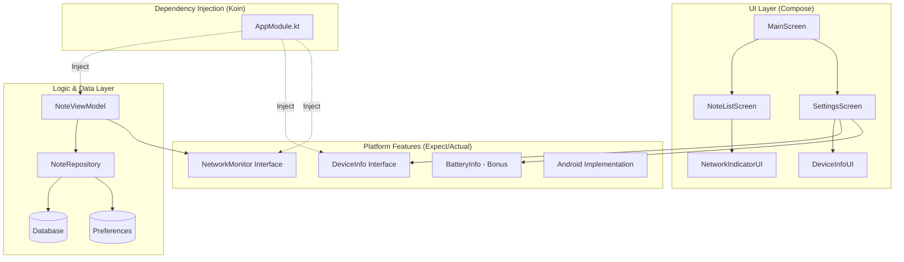

# 📌 TUGAS PRAKTIKUM MINGGU 8 - Notes App Upgrade 🚀

Aplikasi Notes ini merupakan hasil pengembangan lanjutan dengan penambahan fitur berbasis platform serta penerapan **Dependency Injection (DI)** menggunakan **Koin**.

---

## 🏗️ Arsitektur Aplikasi

Proyek ini menggunakan struktur modular dengan pemisahan layer yang jelas antara UI, logic, dan platform:

---

## 📝 Detail Implementasi

1. **Koin Dependency Injection**  
   Koin digunakan untuk mengelola dan menyuntikkan dependency seperti Repository, ViewModel, dan layanan platform.

2. **DeviceInfo (expect/actual)**  
   Digunakan untuk mengambil informasi perangkat dengan pendekatan multiplatform.

3. **NetworkMonitor (expect/actual)**  
   Berfungsi untuk memantau status jaringan secara real-time menggunakan Flow.

4. **UI Informasi Perangkat**  
   Informasi device ditampilkan pada halaman Settings.

5. **Indikator Status Jaringan**  
   Menampilkan kondisi Online/Offline pada halaman utama aplikasi.

6. **Integrasi DI Menyeluruh**  
   Seluruh dependency didefinisikan dalam modul Koin.

---

## ✅ Kriteria Penilaian

| Komponen | Bobot | Keterangan |
| :--- | :---: | :--- |
| **Koin DI Setup** | 25% | Sudah terimplementasi |
| **expect/actual Pattern** | 25% | Digunakan pada DeviceInfo & NetworkMonitor |
| **UI Integration** | 20% | Terhubung dengan baik |
| **Architecture** | 20% | Struktur modular dan rapi |
| **Code Quality** | 10% | Penulisan kode bersih |
| **Bonus ⭐** | +10% | Implementasi BatteryInfo |

---

## 📸 Tampilan Aplikasi

| Home (Online) | Settings (Device & Battery) |
| :---: | :---: |
|  |  |

| Home (Offline) | Profile & Favorites |
| :---: | :---: |
|  |  |

---

## 🎥 Video Demo

Link video (±45 detik): [YouTube / Drive Link](URL_VIDEO_DEMO)  
*(Menampilkan implementasi Koin DI, Device Info, Network Status, dan Battery Info)*

---

## 👤 Identitas Mahasiswa

- **Nama**: Eka Putri Azhari R.
- **NIM**: 123140028
- **Branch**: `week-8`

---

*Pengembangan Aplikasi Mobile - ITERA*