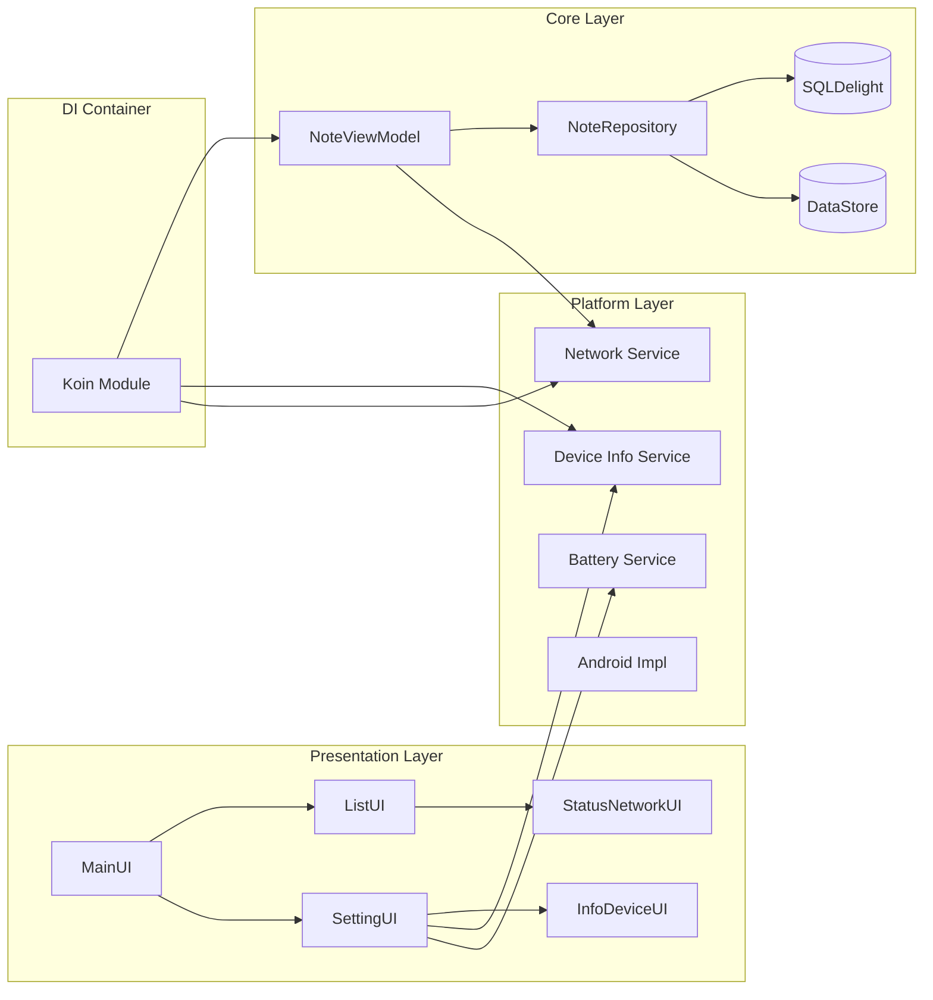

# 🚀 PRAKTIKUM MINGGU 8 - Enhancement Notes App

Aplikasi Notes ini telah dikembangkan dengan menambahkan fitur berbasis platform serta menerapkan konsep **Dependency Injection (DI)** menggunakan **Koin** untuk pengelolaan dependensi yang lebih rapi.

---

## 🏛️ Desain Arsitektur

Struktur aplikasi disusun secara modular untuk memisahkan tanggung jawab antar komponen seperti UI, data, dan layanan platform.

---

## 📚 Penjelasan Fitur

1. **Implementasi Dependency Injection**  
   Koin digunakan untuk mengatur dan menyediakan dependency antar komponen seperti ViewModel dan Repository.

2. **Informasi Perangkat (Device Info)**  
   Menggunakan pendekatan *expect/actual* untuk mengambil data perangkat secara multiplatform.

3. **Pemantauan Jaringan (Network Monitor)**  
   Status koneksi diamati secara real-time menggunakan Flow.

4. **Tampilan Informasi Device**  
   Detail perangkat ditampilkan pada halaman pengaturan (Settings).

5. **Status Koneksi**  
   Indikator Online/Offline ditampilkan pada halaman utama aplikasi.

6. **Manajemen Dependency Terpusat**  
   Semua dependency dikelola dalam satu modul Koin agar lebih terstruktur.

---

## 📊 Penilaian

| Aspek | Persentase | Keterangan |
| :--- | :---: | :--- |
| Dependency Injection | 25% | Sudah diterapkan dengan Koin |
| Multiplatform Pattern | 25% | expect/actual digunakan |
| Integrasi Antarmuka | 20% | UI berjalan dengan baik |
| Struktur Arsitektur | 20% | Modular dan terorganisir |
| Kualitas Kode | 10% | Bersih dan mudah dipahami |
| Bonus ⭐ | +10% | Fitur Battery Info |

---

## 🖼️ Preview Aplikasi

| Halaman Utama (Online) | Menu Settings |
| :---: | :---: |
|  |  |

| Halaman Offline | Profil & Favorit |
| :---: | :---: |
|  |  |

---

## 🎬 Demo Singkat

Link video (±45 detik): [YouTube / Drive Link](URL_VIDEO_DEMO)  
*(Menampilkan fitur DI, info perangkat, status jaringan, dan battery info)*

---

## 👤 Data Mahasiswa

- Nama: Eka Putri Azhari R.  
- NIM: 123140028  
- Branch: `week-8`  

---

*Pengembangan Aplikasi Mobile - ITERA*
